# Shiwu — Aplicación de recetas

**Shiwu** es una aplicación móvil desarrollada con **Flutter y Dart** que permite explorar, buscar y consultar recetas utilizando la API pública [TheMealDB](https://www.themealdb.com/api.php). El proyecto integra manejo de estado, navegación entre pantallas y persistencia local de las preferencias del usuario.

Esta aplicación se desarrolló como proyecto final práctico para la preparación al puesto aspiracional de **Desarrollador Front-End Jr.**

## Características

- **Inicio:** acceso a categorías, búsqueda, recomendación aleatoria y receta favorita.
- **Explorar categorías:** consulta las categorías disponibles mediante TheMealDB.
- **Recetas por categoría:** muestra recetas de la categoría seleccionada.
- **Búsqueda:** busca recetas por nombre y presenta los resultados obtenidos desde la API.
- **Detalle de receta:** muestra imagen, nombre, categoría, región, instrucciones, ingredientes y cantidades, así como enlaces de origen cuando están disponibles.
- **Receta aleatoria:** obtiene recomendaciones aleatorias desde TheMealDB.
- **Favorito:** permite conservar una receta favorita y administrar su selección.
- **Porciones:** ajusta las cantidades de los ingredientes a la porción seleccionada.
- **Tema claro y oscuro:** permite cambiar la apariencia de la aplicación y recordar la preferencia localmente.
- **Estados de interfaz:** contempla estados de carga, resultados, ausencia de coincidencias y errores.

## Tecnologías y dependencias

| Tecnología | Uso |
|---|---|
| [Flutter](https://flutter.dev/) | Desarrollo de la interfaz móvil |
| [Dart](https://dart.dev/) | Lenguaje de programación |
| [TheMealDB](https://www.themealdb.com/api.php) | API REST de recetas |
| [`http`](https://pub.dev/packages/http) | Solicitudes HTTP a la API |
| [`flutter_riverpod`](https://pub.dev/packages/flutter_riverpod) | Manejo de estado |
| [`go_router`](https://pub.dev/packages/go_router) | Navegación entre pantallas |
| [`shared_preferences`](https://pub.dev/packages/shared_preferences) | Persistencia local de preferencias y datos sencillos |
| [`flutter_svg`](https://pub.dev/packages/flutter_svg) | Renderizado de recursos SVG |
| [`url_launcher`](https://pub.dev/packages/url_launcher) | Apertura de enlaces externos |
| [`provider`](https://pub.dev/packages/provider) | Dependencia incluida en el proyecto |

La aplicación utiliza además la familia tipográfica **Nunito** y recursos gráficos almacenados en `assets/`.

## Organización del proyecto

El código de la aplicación está organizado dentro de `lib/` por áreas de responsabilidad:

```text
lib/
├── app/
├── models/
├── providers/
├── screens/
├── services/
├── widgets/
└── main.dart

assets/
└── svg/
```

- **`app/`**: configuración principal de la aplicación y navegación.
- **`models/`**: modelos para representar los datos recibidos de la API.
- **`providers/`**: estado compartido y coordinación de operaciones de la aplicación.
- **`screens/`**: pantallas principales.
- **`services/`**: lógica de acceso a servicios y datos externos.
- **`widgets/`**: componentes de interfaz reutilizables.
- **`assets/`**: recursos de diseño utilizados por la aplicación.

## Requisitos

Necesitas tener instalado:

- [Flutter SDK](https://docs.flutter.dev/get-started/install), con la versión de Dart compatible con el proyecto.
- Un editor compatible, por ejemplo [Visual Studio Code](https://code.visualstudio.com/), con las extensiones de Flutter y Dart.
- Un dispositivo Android/iOS o un emulador configurado.

## Aprendizajes aplicados

Este proyecto reúne prácticas de desarrollo móvil con Flutter:

- Consumo de una API REST y procesamiento de respuestas JSON.
- Conversión de datos externos a modelos de Dart.
- Manejo de estados asíncronos y presentación de estados de carga, error y vacío.
- Gestión de estado con Riverpod.
- Navegación mediante GoRouter.
- Persistencia local de preferencias del usuario.
- Creación de widgets reutilizables y separación de responsabilidades.
- Cálculo de ingredientes a partir de cantidades originales y porciones seleccionadas.

## Capturas de pantalla

Las siguientes capturas muestran las principales pantallas y flujos de Shiwu.

### Pantalla de bienvenida

Presenta la identidad visual de Shiwu y el botón para comenzar a explorar recetas.

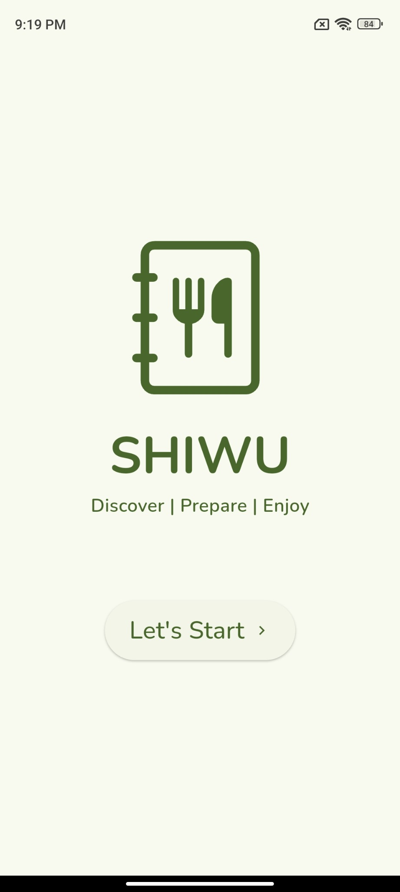

### Inicio

Incluye acceso a la búsqueda, una receta recomendada y la navegación principal.

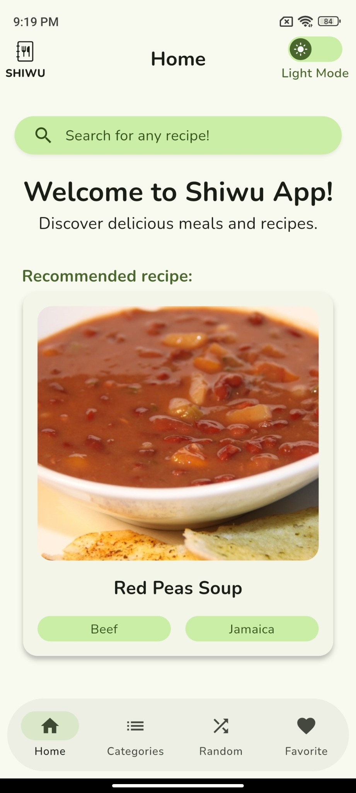

### Búsqueda de recetas

Permite escribir el nombre de una receta para consultar resultados.

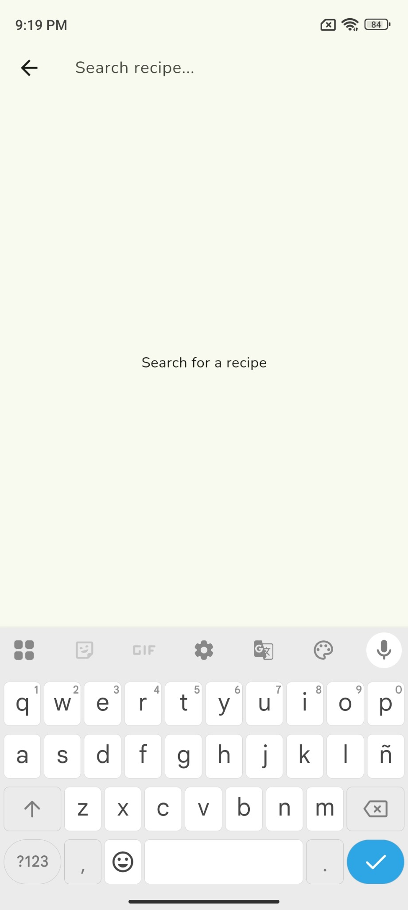

### Categorías

Presenta las categorías de recetas en tarjetas visuales.

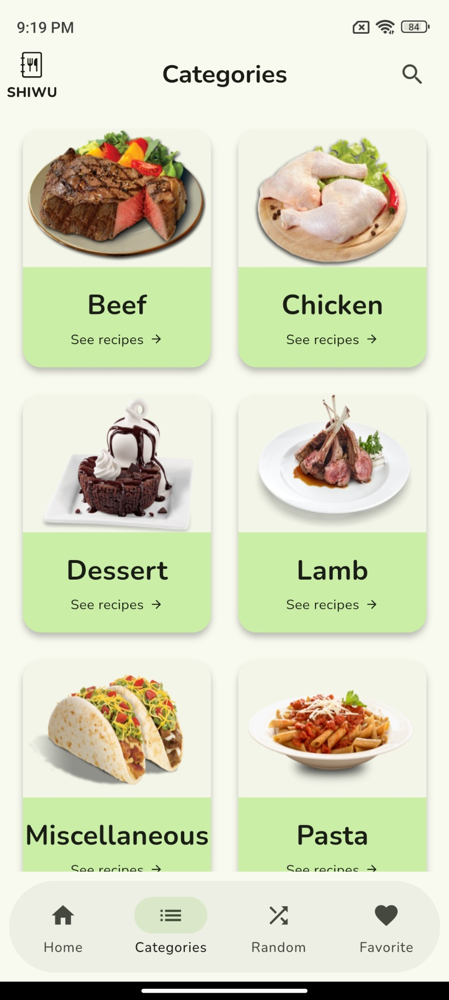

### Receta aleatoria

Muestra una recomendación aleatoria y la opción de solicitar otra.

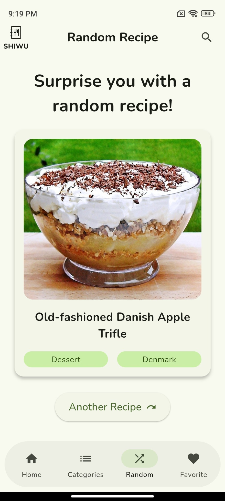

### Favoritos vacíos

Indica que todavía no se ha seleccionado una receta favorita.

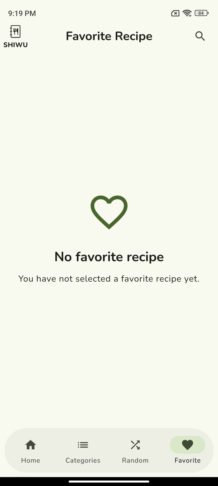

### Recetas por categoría

Lista recetas pertenecientes a la categoría seleccionada, con imagen y acceso al detalle.

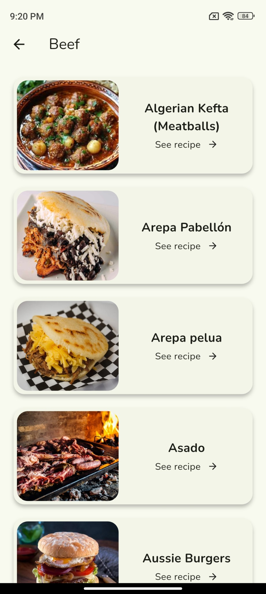

### Detalle: ingredientes

Muestra la imagen, información de la receta, selector de ingredientes e incremento de porciones.

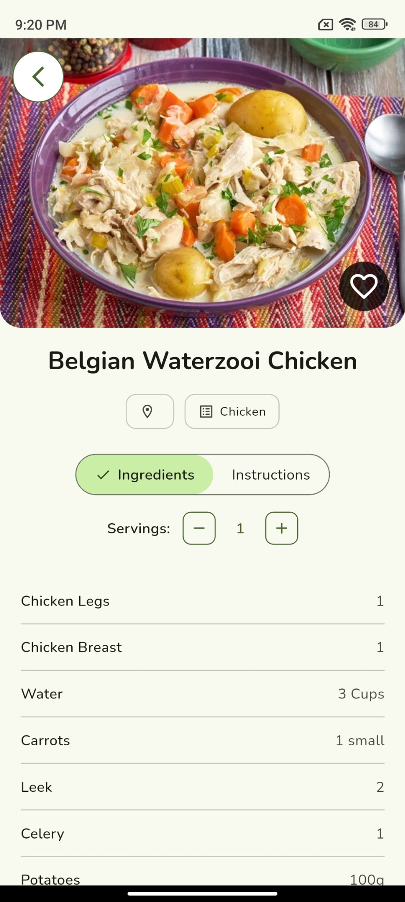

### Detalle: instrucciones

Permite alternar a las instrucciones de preparación de la receta.

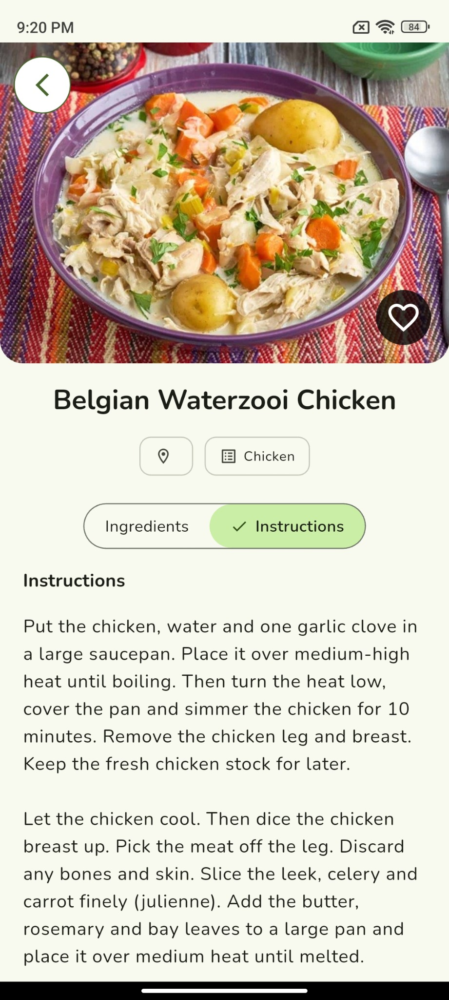

### Confirmación de tutorial

Solicita confirmación antes de salir de la aplicación para abrir un tutorial en YouTube.

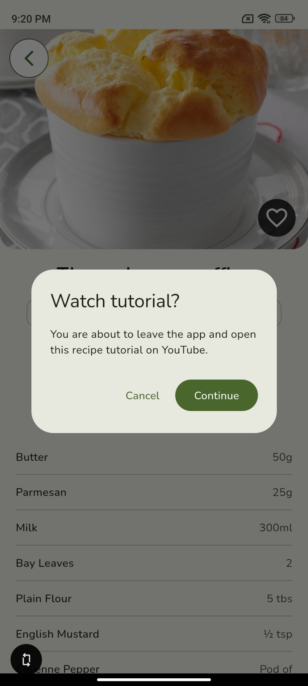

### Receta favorita guardada

Presenta la receta favorita seleccionada y la acción para quitarla.

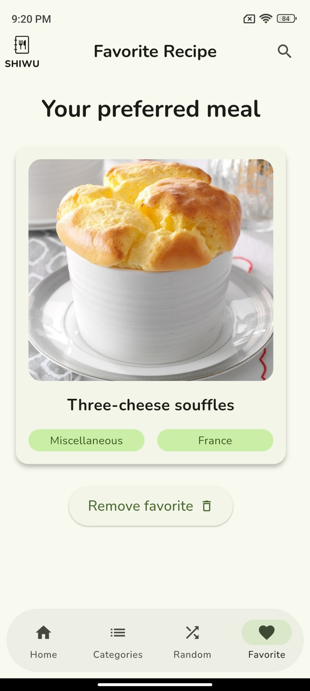

### Confirmación para quitar favorito

Pide confirmar la eliminación de la receta de favoritos.

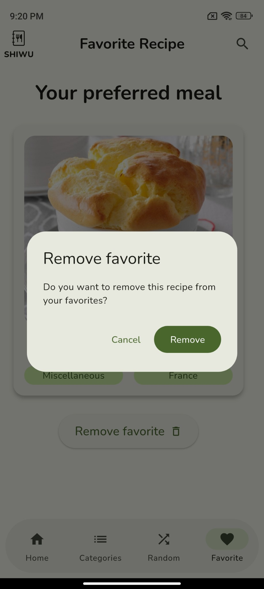

### Tema oscuro: inicio

Muestra la pantalla principal con la paleta adaptada al tema oscuro.

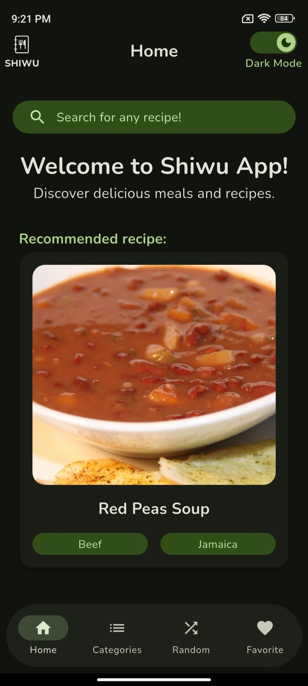

### Tema oscuro: bienvenida

Muestra la pantalla de bienvenida con colores para el tema oscuro.

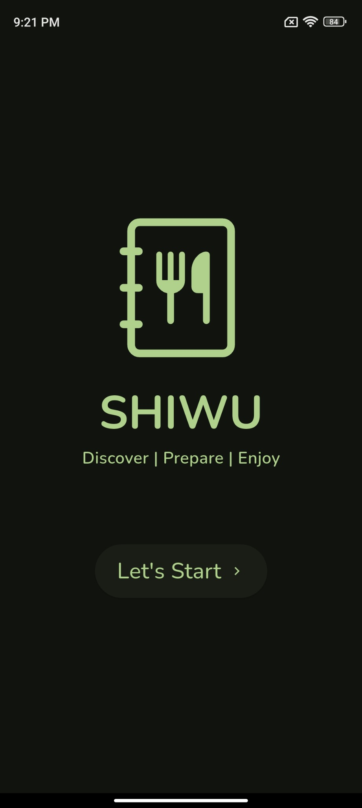

### Tema oscuro: categorías

Muestra las tarjetas de categorías adaptadas al tema oscuro.

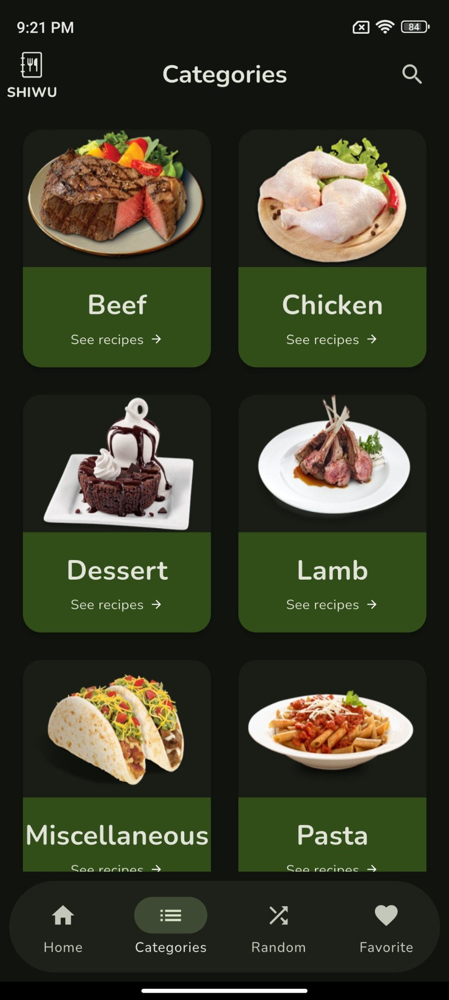

